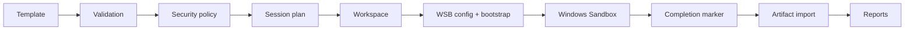

<p align="center">
  
</p>

<p align="center">
  <a href="../../actions/workflows/build.yml"></a>
  <a href="../../actions/workflows/test.yml"></a>
  
  
  <a href="LICENSE"></a>
</p>

# SandForge

> **Forge disposable Windows environments.**

SandForge creates reproducible Windows Sandbox sessions, applies safe templates, runs applications and collects selected results.

🌐 **Русская документация:** [README_RU.md](README_RU.md)

## ✨ What is included

This repository currently contains the **0.1.0-alpha architectural core and the first end-to-end vertical slice**:

- safe template loading for the constrained MVP schema;
- session planning and SHA-256 target hashing;
- security policy evaluation with blocked critical mounts;
- isolated workspace preparation;
- `.wsb` configuration generation;
- generated PowerShell guest bootstrap;
- Windows Sandbox launch and completion marker validation;
- user-output artifact import with quotas and SHA-256;
- console, JSON and standalone HTML reports;
- a dependency-free CLI and basic interactive menu;
- unit tests, GitHub Actions and portable ZIP packaging.

## 🚀 Quick start

```powershell
sandforge doctor
sandforge run .\Application.exe
sandforge session list
sandforge report <session-id> --format html
```

To run the included safe sample:

```powershell
dotnet run --project src/SandForge.Cli -- run-script .\samples\hello-output.ps1
```

## 🔐 Security model

SandForge defaults to disabled network and clipboard, read-only input, a dedicated output directory, SHA-256 verification and a 15-minute timeout. Critical plans such as a writable system-drive mount are blocked.

> Windows Sandbox is an isolation boundary, not an absolute malware guarantee. Review exported artifacts before opening them.

## 🧱 Architecture



See [docs/ARCHITECTURE.md](docs/ARCHITECTURE.md) for design details.

## ⚠️ Current limitations

This alpha is deliberately focused on the first safe vertical slice. Advanced installer diffs, registry/network collectors, package provisioning, template inheritance/includes, SQLite history and full localization are roadmap items, not completed features.

## 🛠️ Build from source

```powershell
dotnet restore
dotnet build
dotnet test
dotnet run --project src/SandForge.Cli -- --help
```

Portable package:

```powershell
.\scripts\package.ps1
```

## 🗺️ Roadmap

See [docs/ROADMAP.md](docs/ROADMAP.md).

## 🤝 Contributing

Read [CONTRIBUTING.md](CONTRIBUTING.md) and [SECURITY.md](SECURITY.md) before opening a pull request.

## 📄 License

MIT — see [LICENSE](LICENSE).
