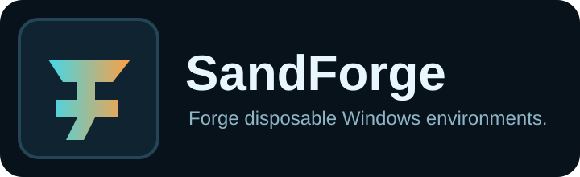
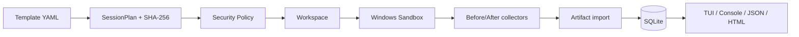

<p align="center">
  
</p>

<p align="center">
  <a href="../../actions/workflows/build.yml"></a>
  <a href="../../actions/workflows/test.yml"></a>
  <a href="../../releases/tag/v0.5.0"></a>
  
  
  <a href="LICENSE"></a>
</p>

# SandForge

> **Создавай, запускай и анализируй одноразовые Windows-окружения.**

**SandForge** — .NET 8 менеджер воспроизводимых сессий **Windows Sandbox**. Он копирует цель в отдельный workspace, применяет ограниченный YAML-шаблон, показывает security plan, запускает guest, собирает разрешённые результаты и формирует автономные отчёты.

🌐 English: [README_EN.md](README_EN.md)

## 📌 Текущая версия

**`0.5.0` — compatibility contracts, versioned schemas и проверка форматов.**

- 📚 каталог публичных контрактов в `schemas/catalog.json`;
- ✅ команды `sandforge schema list|describe|validate`;
- 🧩 JSON Schema Draft 2020-12 для config, templates, reports, completion marker и package manifest;
- 🧾 versioned JSON-отчёты с `schemaVersion`, `generatedAt` и `generatorVersion`;
- 📦 portable package manifest с относительными путями, размерами и SHA-256;
- ⚠️ явная поддержка deprecated-версий и блокировка неизвестных схем до выполнения;
- 🧪 contract tests для текущих и legacy-форматов;
- 🌐 RU/EN CLI, TUI и отчёты.

Возможности предыдущих версий сохранены:

- keyboard-first TUI на Spectre.Console;
- security plan и подтверждение ослабления изоляции;
- безопасные `extends/includes` для шаблонов;
- package и local installer provisioning внутри guest;
- Matrix Runner;
- managed cache с квотами;
- обновления через GitHub Releases с SHA-256, Zip Slip protection, backup и rollback;
- SQLite-история с recovery и безопасной очисткой;
- process, installed-app, file, registry, service и scheduled-task collectors;
- console, JSON и автономные HTML reports.

## 📥 Релиз

Стабильная сборка Windows x64 опубликована в [GitHub Release v0.5.0](../../releases/tag/v0.5.0):

- `SandForge-0.5.0-win-x64.zip`;
- `SandForge-0.5.0-win-x64.zip.sha256`.

Перед запуском сравните SHA-256 архива с приложенным checksum-файлом.

## 🚀 Быстрый старт

```powershell
sandforge
```

Без аргументов открывается TUI. Для автоматизации доступны CLI-команды:

```powershell
sandforge doctor
sandforge run .\Application.exe
sandforge test-installer .\Setup.exe
sandforge matrix run .\Application.exe --templates minimal,isolated-analysis
sandforge session list
sandforge report <session-id> --format html
sandforge schema list
sandforge schema validate .\templates\minimal\sandforge.yaml
sandforge recover
sandforge cleanup --dry-run --older-than 30d
sandforge cache list
sandforge update check
```

## 🖥️ TUI

Главный экран показывает состояние Windows Sandbox, SQLite, каталог данных, язык интерфейса и последние сессии.

Мастер запуска:

1. проверяет целевой файл;
2. предлагает доступные шаблоны;
3. вычисляет SHA-256 и строит план;
4. показывает network, clipboard, mounts, timeout, collectors и findings;
5. блокирует запрещённый план;
6. требует подтверждения для High/Critical risk, сети, clipboard или writable mounts;
7. показывает стадии подготовки, запуска, выполнения и импорта;
8. предлагает создать HTML/JSON report.

Подробнее: [docs/TUI.md](docs/TUI.md).

## 🌐 Язык

В `sandforge.json`:

```json
{
  "ui": {
    "language": "ru"
  }
}
```

Значения: `ru`, `en`, `auto`. Временное переопределение:

```powershell
$env:SANDFORGE_LANGUAGE = 'en'
sandforge
```

Подробнее: [docs/LOCALIZATION.md](docs/LOCALIZATION.md).

## 🧩 Шаблоны

```yaml
schemaVersion: 2
extends: "../common/base.yaml"
metadata:
  name: build-test
  displayName: Build test
sandbox:
  network: enabled
provisioning:
  failurePolicy: stop
  packages:
    - id: Microsoft.DotNet.SDK.8
      version: "8.0.0"
      source: winget
cache:
  enabled: true
  maximumSizeMb: 2048
  types:
    - nuget
```

Ссылки `extends/includes` разрешаются только внутри доверенного корня `templates`; циклы и path traversal блокируются.

Проверка шаблона без запуска:

```powershell
sandforge schema describe template
sandforge schema validate .\templates\minimal\sandforge.yaml
```

## 🔄 Совместимость форматов

| Контракт | Текущая версия | Поддерживаемые | Устаревшие |
|---|---:|---|---|
| `template` | 2 | 1, 2 | 1 |
| `config` | 2 | 2 | — |
| `report` | 1 | 0, 1 | 0 |
| `completion-marker` | 1 | 1 | — |
| `package-manifest` | 1 | 1 | — |

Неизвестная или неподдерживаемая версия отклоняется до выполнения или импорта с exit code `4`. Подробности: [docs/COMPATIBILITY.md](docs/COMPATIBILITY.md).

## 🔐 Безопасность по умолчанию

| Параметр | Значение |
|---|---|
| Сеть | `Disabled` |
| Буфер обмена | `Disabled` |
| Входные данные | копия в session workspace |
| Host mounts | только явно заданные |
| Output | отдельная пустая папка |
| Timeout | обязателен |
| Артефакты | не открываются автоматически |
| Критические mounts | блокируются |

> [!WARNING]
> Windows Sandbox уменьшает риск, но не является абсолютной защитой от вредоносного ПО. Не запускайте экспортированные исполняемые артефакты без отдельной проверки.

## 🧱 Архитектура



| Проект | Ответственность |
|---|---|
| `SandForge.Domain` | language-neutral модели, статусы и compatibility contracts |
| `SandForge.Core` | шаблоны, планирование, schema validation, storage, recovery, cleanup, updates |
| `SandForge.Sandbox` | `.wsb`, guest bootstrap и collectors |
| `SandForge.Reporting` | RU/EN resources и console/JSON/HTML reports |
| `SandForge.Cli` | CLI и Spectre.Console TUI |

## 📚 Документация

- [Команды](docs/COMMANDS.md)
- [Compatibility policy](docs/COMPATIBILITY.md)
- [TUI](docs/TUI.md)
- [Локализация](docs/LOCALIZATION.md)
- [Шаблоны](docs/TEMPLATES.md)
- [Provisioning](docs/PROVISIONING.md)
- [Matrix Runner](docs/MATRIX.md)
- [Managed cache](docs/CACHE.md)
- [Обновления](docs/UPDATES.md)
- [Коллекторы](docs/COLLECTORS.md)
- [SQLite и миграции](docs/STORAGE.md)
- [Восстановление и очистка](docs/RECOVERY.md)
- [Модель безопасности](docs/SECURITY.md)
- [Roadmap](docs/ROADMAP.md)

## 🛠️ Сборка

Требования: Windows 10/11 x64 и .NET 8 SDK.

```powershell
dotnet restore
dotnet build SandForge.sln -c Release
dotnet test SandForge.sln -c Release
dotnet run --project src/SandForge.Cli -- --help
```

Portable ZIP:

```powershell
.\scripts\package.ps1 -Version 0.5.0
```

## ⚠️ Ограничения 0.5.0

- публичные file-format contracts зафиксированы, но долгосрочные гарантии совместимости окончательно вступят в силу после `1.0.0`;
- collectors отражают только guest-систему;
- file snapshot ограничен первыми 50 000 файлами выбранных каталогов;
- registry snapshot охватывает выбранные Run/Uninstall-разделы;
- драйверы, обязательная перезагрузка и kernel-level изменения могут не поддерживаться Sandbox;
- включение сети, clipboard или writable mounts уменьшает изоляцию;
- часть низкоуровневых Core/guest diagnostic messages пока остаётся русской;
- package manifest и checksum подтверждают целостность только при получении из доверенного канала; криптографическая подпись запланирована отдельно.

## 🤝 Участие и безопасность

Правила: [CONTRIBUTING.md](CONTRIBUTING.md). Уязвимости: [SECURITY.md](SECURITY.md). Публичный backlog ведётся в [GitHub Issues](../../issues).

## 📄 Лицензия

MIT — [LICENSE](LICENSE).
