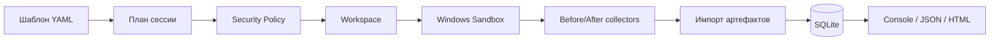

<p align="center">
  
</p>

<p align="center">
  <a href="../../actions/workflows/build.yml"></a>
  <a href="../../actions/workflows/test.yml"></a>
  
  
  
  <a href="LICENSE"></a>
</p>

# SandForge

> **Создавай одноразовые Windows-окружения.**

**SandForge** — консольный менеджер для подготовки, запуска и анализа воспроизводимых сессий **Windows Sandbox**. Он копирует входной файл в отдельный workspace, применяет безопасный шаблон, запускает цель, собирает разрешённые результаты и формирует автономный отчёт.

🌐 English: [README_EN.md](README_EN.md)

## 📌 Текущая версия

**`0.3.0-alpha` — Provisioning, Matrix и GitHub Updates.**

Версия `0.3.0-alpha` развивает SandForge как воспроизводимый runner и добавляет безопасное обслуживание установки:

- 🧩 `extends` и `includes` для переиспользования шаблонов с защитой от циклов и path traversal;
- 📦 package provisioning через `winget` только внутри guest;
- 💿 локальные MSI/EXE provisioning installers с обязательной проверкой SHA-256 перед запуском;
- 🧪 Matrix Runner для запуска одной цели по нескольким шаблонам;
- ⚡ отдельный managed cache для NuGet, npm, pip и winget без подключения пользовательских cache;
- 🔄 проверка и установка обновлений из GitHub Releases;
- 🛡️ проверка release SHA-256, безопасная распаковка и rollback при неуспешном self-check;
- ⏱️ автоматическая проверка обновлений с каналами `stable` и `preview`.

Возможности `0.2.0-alpha` сохранены:

- 🗄️ SQLite-хранилище с миграцией старой JSON-истории;
- 🔎 список процессов после выполнения;
- 📦 изменения установленных приложений;
- 📁 изменения файлов в контролируемых системных каталогах;
- 🧬 изменения выбранных разделов реестра;
- ⚙️ изменения служб и запланированных задач;
- 🧾 HTML/JSON/console-отчёты с результатами коллекторов;
- 🧯 изоляция ошибок: сбой одного collector не отменяет остальные;
- ♻️ восстановление сессий после аварийного завершения host-процесса;
- 🧹 безопасная очистка старых и orphaned-workspace;
- 🇷🇺 русский CLI и русская документация по умолчанию.

## 🚀 Быстрый старт

```powershell
sandforge doctor
sandforge run .\Application.exe
sandforge test-installer .\Setup.exe
sandforge session list
sandforge report <session-id> --format html
sandforge matrix run .\Application.exe --templates minimal,isolated-analysis
sandforge update check
sandforge update install
```

### Проверка установщика

```powershell
sandforge test-installer .\Setup.exe
```

Шаблон `installer-test` создаёт снимки до и после запуска и сохраняет JSON-diff по приложениям, файлам, реестру, службам и задачам.

### Восстановление после сбоя

```powershell
sandforge recover
```

Команда проверяет незавершённые записи SQLite. При наличии валидного `completed.json` результаты импортируются; иначе сессия получает статус `Orphaned`.

### Очистка

```powershell
sandforge cleanup --dry-run --older-than 30d
sandforge cleanup --older-than 30d
sandforge cleanup --orphaned --older-than 1h
```

`--dry-run` показывает план и ничего не удаляет.

## 🔄 Обновления через GitHub

```powershell
sandforge update check
sandforge update install --yes
sandforge update auto on
sandforge update auto on --apply
sandforge update channel stable
```

SandForge читает GitHub Releases репозитория `Onmaynec/SandForge`, скачивает ZIP и соответствующий `.sha256`, проверяет хеш, безопасно распаковывает package и применяет замену после завершения текущего процесса. Перед заменой создаётся backup; если новая версия не проходит `--version` self-check, файлы восстанавливаются автоматически. Автоустановка выполняется только после явного включения `update auto on --apply`.

## 🧩 Шаблоны 0.3

```yaml
schemaVersion: 2
extends: "../common/base.yaml"
metadata:
  name: build-test
  displayName: Build test
sandbox:
  network: enabled
provisioning:
  failurePolicy: stop
  packages:
    - id: Microsoft.DotNet.SDK.8
      version: "8.0.0"
      source: winget
cache:
  enabled: true
  maximumSizeMb: 2048
  types:
    - nuget
```

Ссылки `extends/includes` разрешаются только внутри корня `templates`; циклы и выход через `..` за доверенный корень блокируются.

## 🔐 Безопасность по умолчанию

| Параметр | Значение |
|---|---|
| Сеть | `Disabled` |
| Буфер обмена | `Disabled` |
| Входные данные | копия в session workspace |
| Host mounts | только явно заданные |
| Output | отдельная пустая папка |
| Timeout | обязателен |
| Артефакты | не открываются автоматически |
| Критические mounts | блокируются |

> [!WARNING]
> Windows Sandbox уменьшает риск, но не является абсолютной защитой от вредоносного ПО. Не запускайте экспортированные исполняемые артефакты без отдельной проверки.

## 🧱 Архитектура



Подробности: [docs/ARCHITECTURE.md](docs/ARCHITECTURE.md).

## 📚 Документация

- [Команды](docs/COMMANDS.md)
- [Шаблоны](docs/TEMPLATES.md)
- [Коллекторы](docs/COLLECTORS.md)
- [SQLite и миграции](docs/STORAGE.md)
- [Восстановление и очистка](docs/RECOVERY.md)
- [Модель безопасности](docs/SECURITY.md)
- [Приватность](docs/PRIVACY.md)
- [Устранение неполадок](docs/TROUBLESHOOTING.md)
- [Roadmap](docs/ROADMAP.md)
- [Backlog и GitHub Issues](docs/BACKLOG.md)

## 🛠️ Сборка

Требования: Windows 10/11 x64, .NET 8 SDK и доступная функция Windows Sandbox.

```powershell
dotnet restore
dotnet build SandForge.sln -c Release
dotnet test SandForge.sln -c Release
dotnet run --project src/SandForge.Cli -- --help
```

Portable ZIP:

```powershell
.\scripts\package.ps1 -Version 0.3.0-alpha
```

## ⚠️ Ограничения alpha

- коллекторы выполняются внутри Windows Sandbox и отражают только guest-систему;
- file snapshot ограничен первыми 50 000 файлами выбранных каталогов;
- registry snapshot охватывает выбранные Run/Uninstall-разделы, а не весь реестр;
- драйверы, обязательная перезагрузка и kernel-level изменения могут не поддерживаться Sandbox;
- включение сети, clipboard или writable mounts уменьшает изоляцию.

## 🤝 Участие и безопасность

Правила: [CONTRIBUTING.md](CONTRIBUTING.md). Уязвимости: [SECURITY.md](SECURITY.md). Публичный backlog ведётся в GitHub Issues.

## 📄 Лицензия

MIT — [LICENSE](LICENSE).
