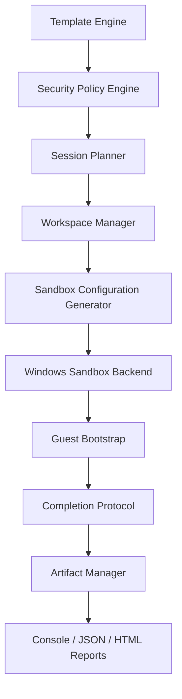

<p align="center">
  
</p>

<p align="center">
  <a href="../../actions/workflows/build.yml"></a>
  <a href="../../actions/workflows/test.yml"></a>
  
  
  <a href="LICENSE"></a>
</p>

# SandForge

> **Создавай одноразовые Windows-окружения.**

**SandForge** — консольный инструмент для подготовки, запуска и контроля воспроизводимых сессий **Windows Sandbox**. Он копирует входной файл во временное окружение, применяет безопасный шаблон, запускает цель и импортирует только разрешённые результаты.

## 📌 Состояние проекта

Текущая версия — **0.1.0-alpha**. Реализовано архитектурное ядро и первый сквозной сценарий, требуемый техническим заданием:

```text
Шаблон → план сессии → политика безопасности → workspace
→ .wsb-конфигурация → guest bootstrap → completion marker
→ импорт артефактов → отчёт
```

Расширенные collectors и анализ установщиков пока находятся в roadmap.

## ✨ Возможности MVP

- 🧩 декларативные YAML-шаблоны ограниченной безопасной схемы;
- 🔐 отключённые по умолчанию сеть и буфер обмена;
- 🧮 SHA-256 для входного файла и каждого импортированного артефакта;
- 📁 отдельные каталоги `input`, `output`, `bootstrap`, `config`, `artifacts`, `logs` и `metadata`;
- 🛡️ блокировка критически опасных writable mounts;
- 🪟 генерация `.wsb` и запуск Windows Sandbox;
- ⚙️ bootstrap-сценарий с безопасной передачей аргументов;
- ✅ проверка `completed.json` по `schemaVersion` и `sessionId`;
- 📦 квоты на размер и количество артефактов;
- 📊 консольный, JSON- и автономный HTML-отчёт;
- 🧰 CLI, простое интерактивное меню, тесты и GitHub Actions;
- 💾 portable-режим через файл `portable.mode`.

## 🚀 Быстрый старт

### 1. Проверь систему

```powershell
sandforge doctor
```

### 2. Запусти файл в изоляции

```powershell
sandforge run .\Application.exe
```

### 3. Посмотри историю

```powershell
sandforge session list
sandforge session show <session-id>
```

### 4. Создай HTML-отчёт

```powershell
sandforge report <session-id> --format html
```

## 🧪 Безопасный пример

В репозитории есть скрипт, создающий текстовый файл в разрешённой output-папке:

```powershell
dotnet run --project src/SandForge.Cli -- run-script .\samples\hello-output.ps1
```

Ожидаемый артефакт:

```text
hello-from-sandbox.txt
```

## 🧱 Архитектура



Подробности: [docs/ARCHITECTURE.md](docs/ARCHITECTURE.md).

## 🔐 Модель безопасности

Безопасные значения по умолчанию:

| Параметр | Значение |
|---|---|
| Сеть | `Disabled` |
| Буфер обмена | `Disabled` |
| Input | копия, доступная guest только для чтения |
| Output | отдельная пустая папка |
| Timeout | 15 минут |
| Protected Client | включён |
| Артефакты | не запускаются автоматически |

Критические конфигурации блокируются. Например, SandForge не разрешит writable-монтирование системного диска или чувствительной пользовательской директории.

> [!WARNING]
> Windows Sandbox снижает риск, но не гарантирует абсолютную защиту. Не запускайте экспортированные `.exe`, `.dll`, `.ps1`, `.msi` и другие исполняемые артефакты без отдельной проверки.

## 📂 Структура сессии

```text
sessions/<session-id>/
├── input/
├── output/
├── bootstrap/
├── config/
├── artifacts/
├── logs/
├── metadata/
└── session metadata
```

## 🧾 Шаблоны

Встроены три стартовых шаблона:

| Шаблон | Назначение |
|---|---|
| `isolated-analysis` | запуск неизвестного приложения без сети |
| `powershell-clean` | выполнение локального PowerShell-скрипта в чистом окружении |
| `minimal` | минимальная офлайн-сессия |

Формат и ограничения описаны в [docs/TEMPLATES.md](docs/TEMPLATES.md).

## 💾 Portable mode

Создай рядом с `sandforge.exe` пустой файл:

```text
portable.mode
```

После этого данные будут храниться в локальной папке `data`, а не в `%LocalAppData%\SandForge`.

## 🛠️ Сборка из исходников

Требования:

- Windows 10/11 x64;
- .NET 8 SDK;
- включённая аппаратная виртуализация;
- доступная функция Windows Sandbox.

```powershell
dotnet restore
dotnet build
dotnet test
dotnet run --project src/SandForge.Cli -- --help
```

Создание portable ZIP:

```powershell
.\scripts\package.ps1
```

## ⚠️ Ограничения

- Windows Sandbox доступна не во всех редакциях Windows.
- Некоторые программы, драйверы и установщики с перезагрузкой не работают в Sandbox.
- Включение сети, clipboard или writable mounts уменьшает изоляцию.
- MVP ещё не выполняет полный registry/service/task diff.
- Текущий YAML reader поддерживает только документированную ограниченную схему MVP.
- История в alpha хранится в атомарно обновляемом JSON; миграция на SQLite запланирована.

## 🗺️ Roadmap

Смотри [docs/ROADMAP.md](docs/ROADMAP.md).

## 🤝 Участие в разработке

Правила находятся в [CONTRIBUTING.md](CONTRIBUTING.md). Сообщения об уязвимостях — по инструкции в [SECURITY.md](SECURITY.md).

## 📄 Лицензия

Проект распространяется по лицензии MIT. Подробнее: [LICENSE](LICENSE).
