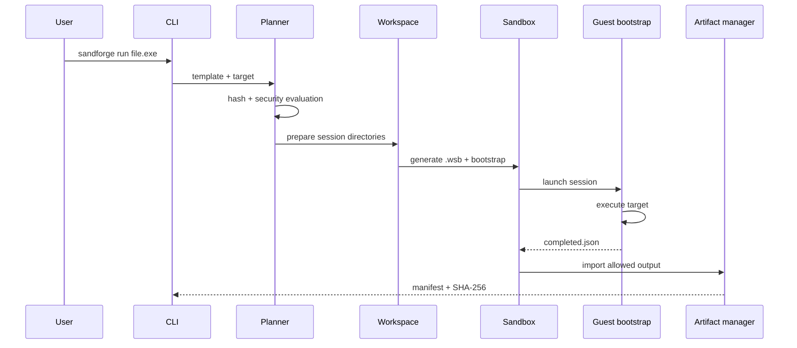

# 🧱 Архитектура SandForge

## Цель первой итерации

Версия `0.1.0-alpha` реализует один проверяемый vertical slice: создать изолированный workspace, сгенерировать `.wsb`, запустить Windows Sandbox, дождаться подписанного контекстом сессии completion marker и импортировать разрешённый output с SHA-256.

## Компоненты

| Проект | Ответственность |
|---|---|
| `SandForge.Domain` | неизменяемые модели, статусы, риски и контракты |
| `SandForge.Core` | шаблоны, безопасность, планирование, workspace, артефакты и координация |
| `SandForge.Sandbox` | проверка доступности, `.wsb`-генератор и запуск backend |
| `SandForge.Reporting` | console, JSON и автономный HTML |
| `SandForge.Cli` | команды, exit codes и базовый TUI |

## Поток выполнения

## Границы доверия

1. **Host input** никогда не запускается напрямую — сначала копируется в session input.
2. **Guest output** считается недоверенным.
3. **Completion marker** принимается только при совпадении `schemaVersion` и `sessionId`.
4. **Artifacts** импортируются с квотами, проверкой пути и SHA-256.
5. **Writable mounts** проходят отдельную security evaluation; критические пути блокируются.

## Осознанные упрощения alpha

- constrained YAML parser вместо полного YAML 1.2;
- JSON-индекс истории вместо SQLite;
- один backend Windows Sandbox;
- user-output collector вместо полного набора collectors;
- простой Console TUI без сторонних UI-зависимостей.

Эти решения уменьшают площадь атаки и позволяют сначала проверить ключевой end-to-end сценарий.
